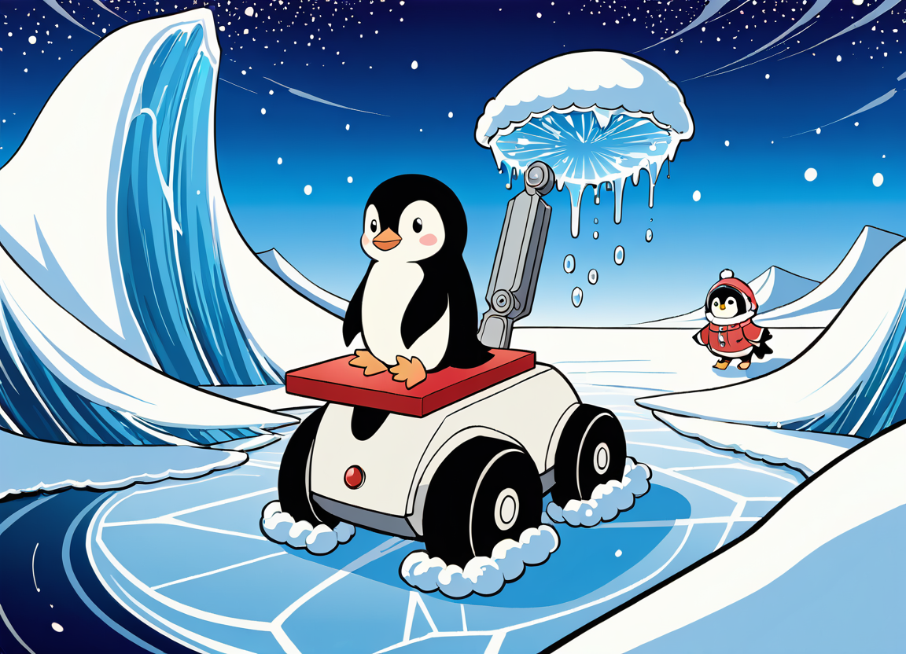

# slipice

Discord bot source for the our slipice bot

---

## Running

Run the app with `make`.

### Environment variables
Have a .env with the BOTTOKEN variable set.

### Dependencies
* [DiscordGo](https://github.com/bwmarrin/discordgo) - API Bindings

## Contributing

Open to contributions. Feel free to open up an issue or pull request.

## License

This project is licensed under the [BSD 3 Clause License](LICENSE)
